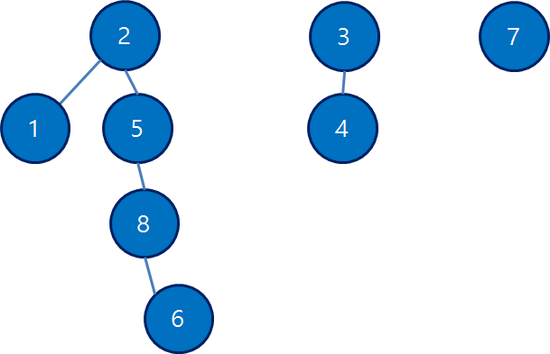
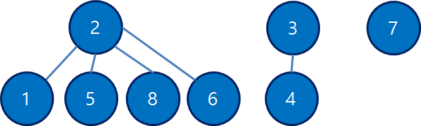

## 개요

유니온 파인드는 Disjoint Set (서로소 집합) 또는 Merge Find Set (병렬 찾기 집합) 으로 불리며, 말 그대로 서로소인 집합들을 표현하는 자료구조이다. 즉, 어떤 집합 사이에도 교집합의 원소가
하나도 없고, 모든 집합의 합집합은 전체 집합과 같다는 말이다. 기본적으로 union, find 단 2개의 연산만을 지원한다.

## 예시

{1}, {2}, {3}, {4}, {5}, {6}, {7}, {8}   
위 집합들은 아무런 연산이 가해지지 않은 제일 초기의 크기 8인 유니온 파인드이고, 포함하고 있는 집합 또한 8개 이다.

몇 번의 연산이 이루어 진 후 {1, 2, 5, 6, 8}, {3, 4}, {7} 의 형태가 되었다.   
아래의 그림은 변경 후 상태를 나타내는 포레스트이다.



가장 위에 있는 노드가 각 트리의 루트라고 한다면, 그 트리에 속한 정점들은 모두 같은 집합에 속해있다. 같은 집합이더라도 표현할 수 있는 방법은 수 없이 많으며, 위 그림은 그 중 한가지를 표현해 놓은 것이다.

## 구현

### find 연산

두 원소가 같은 집합에 속해 있는지 확인하려면, 두 원소의 루트를 찾아 루트가 서로 같은지 비교하면 된다. 그러기 위해서 필요한 연산이 **find** 연산으로, 어떤 정점의 루트를 찾아주는
역할을 한다.

```java
/**
 * 원소 n을 받아 n의 root노드를 반환
 * @param n 루트를 찾을 정점
 * @return root 노드
 */
int find(int n) {
   if(parent[n]< 0) {
       return n;
   }
   return find(parent[n]);
}
```

자신의 부모를 가리키는 배열이 parent 이고, 루트의 값은 -1 이라고 가정하여 짜본 코드인데, 이 코드의 한 가지 문제점이 있다. 위의 그림과 같은 트리에서 find(6)을 수행한다면, 6부터 2까지의 경로가 일직선이기 때문에, 많은
재귀 호출이 이루어진다는 것이다. 한번 개선 해보자.

```java
int find(int n) {
   if(parent[n]< 0) {
       return n;
   }
   
   parent[n] = find(parent[n]);
   return parent[n];
}
```

별로 바뀐 것이
없어보이지만 파인드 연산을 수행할 때마다 트리의 구조를 평평하게 만들어 경로를 압축하였다. 최종적으로는 아래와 같은 그림이 된다.



이렇게 바뀐 로직의 시간 복잡도는 선형 시간과 거의 동급으로 취급한다.
(크기가 N인 유니온 파인드 구조에 M번 find 연산을 한다면, 최악의 시간 복잡도는 O(MN).)

정확히는 O(Mlog * N) 이지만 저 로그 스타라는 함수는 아크만 함수의 역함수로 매우 느리게 증가해서 O(M)으로 봐도 무방하다.

### union 연산

두 집합을 하나로 합쳐주는 연산이다. Union-Find 자료구조의 연산은 알아본 바와 같이 find 연산, union 연산 두 가지 뿐이라서, 한 번 합친 집합을 다시 분할하는 것은 굉장히 힘들지만, 보통 합치는 작업만 필요할 때 유용하다. 그럼 union 연산을 구현해보자.

```java
void merge(int a,int b) {
    a=find(a);
    b=find(b);
    
    if(a!=b){
        parent[b]=a
    }
}
```

굉장히 구현이 간단하다. b의 루트의 부모를 a로 만들면 된다. 함수명이 union 이 아니라 merge 인 이유는 C언어 공용체(union) 전용 키워드가 union 이기 때문에 사용하지 못하기 때문. union 연산의 시간 복잡도도 find 연산과 마찬가지로 O(M)으로 봐도 무방하다.

--- 

[참고 사이트]   
[https://kks227.blog.me/](https://kks227.blog.me/)

