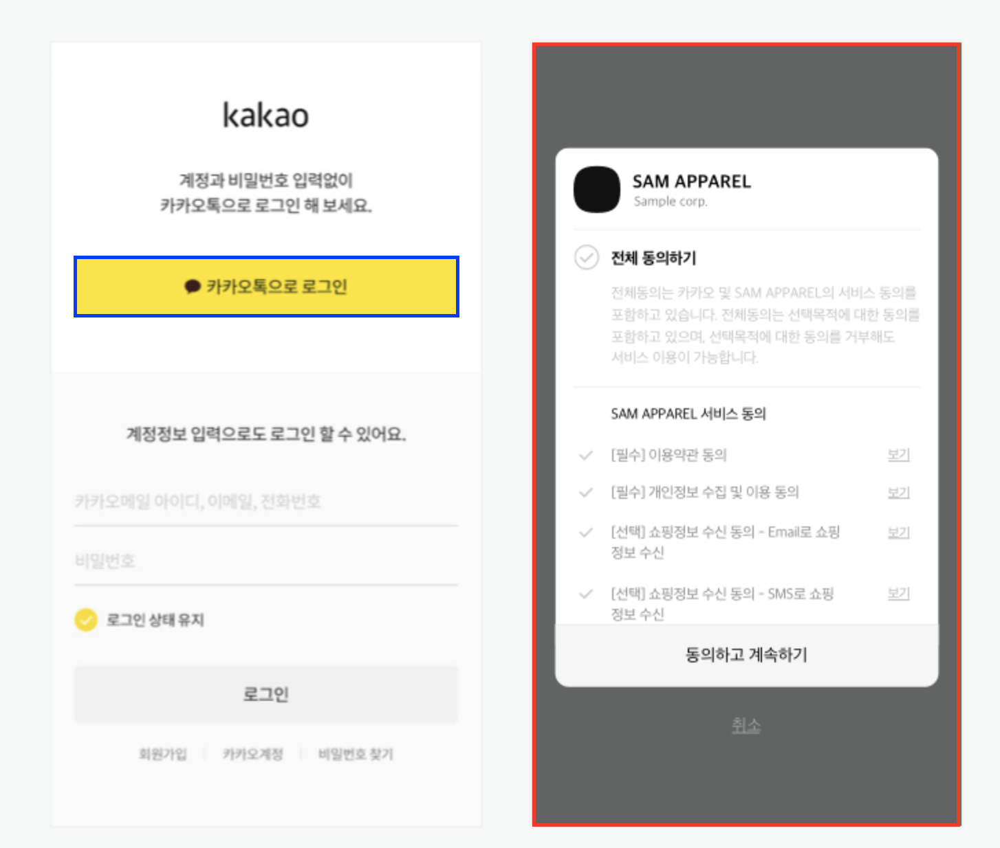

## Introduction

OAuth는 오픈 API의 인증(authentication)[^1]과 권한 부여(authorization)[^2]를 제공하기 위해 만들어진 프로토콜이다. OAuth 1.0을 거쳐 현재는 OAuth 2.0 표준안인 [RFC 6749](https://datatracker.ietf.org/doc/html/rfc6749)가 널리 사용되고 있다. OAuth 2.0에 대해 알아보자.

### Rules

OAuth 2.0에서는 아래와 같이 4가지 역할을 정의한다.

1. 리소스 소유자 (Resource Owner)
   보호된 리소스의 소유자를 뜻한다. 예를 들어 계좌 잔액이라는 리소스가 있다고 한다면, 계좌의 소유자가 리소스 소유자에 해당된다.
2. 리소스 서버 (Resource Service)
   보호된 리소스를 제공하는 서버를 의미한다. 예를 들어 오픈뱅킹 서버를 들 수 있다. 오픈뱅킹 서버는 은행들의 API를 사용하여 계좌와 관련된 각종 리소스를 제공해주는 리소스 서버이다.
3. 클라이언트 (Client)
   오픈 API를 호출하는 응용 프로그램을 의미한다.
4. 인증 서버 (Authorization Server)
   리소스 소유자로부터 접근 권한을 획득한 이후에 자원에 접근하기 위한 토큰(Access Token)을 발급해주는 서버를 말한다.

### Protocol Flow

다음의 표는 OAuth 2.0의 대략적인 흐름을 나타낸다.

```
+--------+                               +---------------+
|        |--(1)- Authorization Request ->|   Resource    |
|        |                               |     Owner     |
|        |<-(2)-- Authorization Grant ---|               |
|        |                               +---------------+
|        |
|        |                               +---------------+
|        |--(3)-- Authorization Grant -->| Authorization |
| Client |                               |     Server    |
|        |<-(4)----- Access Token -------|               |
|        |                               +---------------+
|        |
|        |                               +---------------+
|        |--(5)----- Access Token ------>|    Resource   |
|        |                               |     Server    |
|        |<-(6)--- Protected Resource ---|               |
+--------+                               +---------------+
```

1. 클라이언트는 리소스 서버에 접속하여 API를 사용하기 위해, 먼저 리소스 소유자에게 인증을 요청해야한다. 인증 요청은 리소스 소유자에게 직접 할 수도 있지만, 중간에 인증 서버를 통해 간접적으로 하는 것이 좋다.
2.  클라이언트는 인가 승인을 받는다. 인가 승인은 [인가 승인 유형](https://datatracker.ietf.org/doc/html/rfc6749#section-1.3) 중 한 가지를 선택하여 사용한다.
3. 클라이언트는 리소스 서버에게 (2)에서 승인 받은 인가를 제시하여 Access Token을 요청한다.
4. 리소스 서버는 클라이언트의 권한이 유효한지 확인하고, 유효한 경우 Acess Token을 발급한다.
5. 클라이언트는 Access Token을 사용하여 리소스 서버에게 보호된 리소스를 요청한다.
6. 리소스 서버는 Access Token이 유효한지 확인하고, 유효한 경우 리소스를 제공한다.

### Access Token

Access Token은 보호된 리소스에 접근하기 위해 사용된다. 클라이언트에게 발급된 인가를 나타내는 문자열이며, 보통 클라이언트가 알아볼 수 없다. 토큰에는 리소스에 접근할 수 있는 범위와 기간이 명시된다. 리소스 소유자에 의해 생성되고, 리소스 서버와 인증 서버에서 사용된다.

### Refresh Token

Refresh Token은 접근 토큰을 얻는 데 사용된다. Access Token이 유효하지 않거나 만료된 경우 새로운 Access Token을 얻거나, 동일하거나 더 좁은 범위로 추가적인 Access Token을 얻기 위해 사용된다. Refresh Token의 발급은 인증 서버의 선택 사항이다. 만약 인가 서버가 Refresh Token을 발급한다면 [Protocol Flow](#protocol-flow)의 2번에서 Access Token과 함께 발급한다.

Refresh Token은 클라이언트가 리소스 소유자에 의해 인가가 승인되었음을 나타내는 문자열이며, 보통 클라이언트가 알아볼 수 없다. AccessToken과는 달리 인증 서버에서만 사용되며, 리소스 서버로 전송되지 않는다. 아래의 표는 Refresh Token을 이용해 Access Token을 갱신하는 흐름이다.

```
+--------+                                           +---------------+
|        |--(1)------- Authorization Grant --------->|               |
|        |                                           |               |
|        |<-(2)----------- Access Token -------------|               |
|        |               & Refresh Token             |               |
|        |                                           |               |
|        |                            +----------+   |               |
|        |--(3)---- Access Token ---->|          |   |               |
|        |                            |          |   |               |
|        |<-(4)- Protected Resource --| Resource |   | Authorization |
| Client |                            |  Server  |   |     Server    |
|        |--(5)---- Access Token ---->|          |   |               |
|        |                            |          |   |               |
|        |<-(6)- Invalid Token Error -|          |   |               |
|        |                            +----------+   |               |
|        |                                           |               |
|        |--(7)----------- Refresh Token ----------->|               |
|        |                                           |               |
|        |<-(8)----------- Access Token -------------|               |
```

## Obtaining Authorization

OAuth는 네 가지 승인 유형(Authorization Code Grant, Implicit Grant, Authorization Request, Access Token Response)을 제공한다. 이 포스팅에서는 네이버, 카카오 등에서 가장 많이 사용되는 Authorization Code Grant 방식에 대해서만 설명한다. 다른 승인 유형에 관한 내용은 [rfc6749#section-4.1](https://datatracker.ietf.org/doc/html/rfc6749#section-4.1)를 참고한다.

### Authorization Code Grant

이 승인 유형은 Access Token과 Refresh Token을 모두 발급받기 위해 사용된다. 기밀 클라이언트에 최적화 되어 있다. 리다이렉션을 기반으로 동작하기 때문에 클라이언트는 리소스 소유자의 User-Agent(일반적으로 웹 브라우저)와 상호작용 할 수 있어야 하며, 인증 서버로부터 들어오는 요청을 받을 수 있어야 한다.

```
+----------+
| Resource |
|   Owner  |
|          |
+----------+
     ^
     |
    (2)
+----|-----+          Client Identifier      +---------------+
|         -+----(1)-- & Redirection URI ---->|               |
|  User-   |                                 | Authorization |
|  Agent  -+----(2)-- User authenticates --->|     Server    |
|          |                                 |               |
|         -+----(3)-- Authorization Code ---<|               |
+-|----|---+                                 +---------------+
  |    |                                         ^      v
 (1)  (3)                                        |      |
  |    |                                         |      |
  ^    v                                         |      |
+---------+                                      |      |
|         |>---(4)-- Authorization Code ---------'      |
|  Client |          & Redirection URI                  |
|         |                                             |
|         |<---(5)----- Access Token -------------------'
+---------+       (w/ Optional Refresh Token)
```

> **NOTE**: 1,2,3 단계는 User-Agent를 통해 전달되므로 부 부분으로 나뉘어 짐

1. 클라이언트가 리소스 소유자의 User-Agent를 인증 Endpoint로 이동시키며 흐름이 시작된다. 클라이언트는 자신의 식별자, requested scope, local state, 인증이 승인 또는 거부될 경우 User-Agent를 돌려보낼 리다이렉션 URI을 포함한다.
2. 인증 서버는 User-Agent를 통해 리소스 소유자를 인증하고, 리소스 소유자는 User-Agent를 통해 클라이언트의 접근 요청에 승인 혹은 거부할 지 결정한다.
3. 리소스 소유자가 접근 요청을 승인했다고 가정하여, 인증 서버는 User-Agent를 제공된 리다이렉션 URI로 이동시킨다. 이때 리다이렉션 URI에는 인증 코드와 local state가 포함된다.
4. 클라이언트는 이전 단계에서 받은 인증 코드를 포함하여 인증 서버에 Access Token을 요청한다. 이 때 인증 코드를 얻기 위해 사용했던(3번 과정) 리다이렉션 URI을 포함한다. 요청을 보낼때 클라이언트는 인증 서버에 인증한다.
5. 인증 서버는 인증 코드가 유효한지 확인하고, 3번에서 사용한 리다이렉션 URI와 4번에서 전달받은 리다이렉션 URI가 동일한지 확인한다. 유효하다는 게 확인되면 Access Token과, (선택적으로) Refresh Token을 응답한다.

1번, 2번 과정의 이해를 돕기 위해 다음 그림을 보자.



이 이미지에서 파란색 박스(카카오톡으로 로그인)을 클릭하면 1번 과정이 진행되는 것이고, 빨간색 박스의 동의하고 계속하기 버튼을 누르면 2번 과정의 승인을 하는 것이다.

#### Authorization Request

클라이언트는 인증 코드 요청을 할 때 `application/x-www-form-urlencoded` 를 사용하여 다음 파라미터를 포함해야한다.

* `response_type`  
  **필수.** "code"로 고정
* `client_id`  
  **필수.** 클라이언트의 식별자
* `redirect_uri`  
  **선택사항.** [rfc6749#section-3.1.2](https://datatracker.ietf.org/doc/html/rfc6749#section-3.1.2) 참고
* `scope`  
  **선택사항.** [rfc6749#section-3.3](https://datatracker.ietf.org/doc/html/rfc6749#section-3.3) 참고
* `state`  
  **권장사항.** 인증 서버는 User-Agent를 클라이언트로 리다이렉트할 때 이 값을 포함한다. [section-10.12](https://datatracker.ietf.org/doc/html/rfc6749#section-10.12)에 기술된대로 사이트 간 요청 위조(Cross-Site Request Forgery)를 방지하는 데 사용하는 것이 좋다.

카카오 인가 코드 받기의 경우도 이 규칙을 지켜 다음과 같은 요청을 사용한다.

```
GET /oauth/authorize?client_id={REST_API_KEY}&redirect_uri={REDIRECT_URI}&response_type=code HTTP/1.1
Host: kauth.kakao.com
```

#### Authorization Response

리소스 소유자가 접근 요청을 승인하면, 인증 서버는 다음의 파라미터를 `application/x-www-form-urlencoded` 를 사용하여 클라이언트에게 전달한다.

* `code`  
  **필수.** 인증 서버에서 생성된 인증 코드이다. 유출 위험을 줄이기 위해 만료 시간이 짧아야 하며 최대 10분이 권장된다. 클라이언트는 인증 코드를 두 번 이상 사용하면 안된다. 만약 두번 이상 사용될 경우 인증 서버는 요청을 거부해야 하며, 해당 인증 코드 이전에 발급된 모든 토큰을 취소하는 것이 좋다.
* `state`  
  클라이언트가 인증 요청 시 `state` 파라미터를 포함했다면 **필수.** 클라이언트로부터 전달 받은 값과 동일해야한다.

카카오 인가 코드 받기의 경우도 이 규칙을 지켜 다음과 같은 응답을 사용한다.

```
HTTP/1.1 302 Found
Content-Length: 0
Location: {REDIRECT_URI}?code={AUTHORIZE_CODE}
```

#### Error Response

요청이 누락되거나, 유효하지 않는 경우, 리다이렉션 URI가 일치하지 않는 경우, 클라이언트 식별자가 누락되거나 유효하지 않는 경우는 User-Agent를 유효하지 않은 URI로 리다이렉트 되게 해서는 안된다. 이 경우에 인증 서버는 다음 파라미터를 사용하여 리소스 소유자에게 오류를 알려주는 것이 좋다. 이 역시 `application/x-www-form-urlencoded` 방식을 사용한다.

* `error`  
  **필수.** 다음의 에러 코드 사용
  * invalid_request  
    요청 시 필수 파라미터의 누락, 유효하지 않은 파라미터 포함, 파라미터를 두 번 이상 포함 등
  * unauthorized_client  
    클라이언트가 이 인가 승인 유형을 사용할 권한이 없음
  * access_denied  
    리소스 소유자 또는 인증 서버가 요청을 거부
  * unsupported_response_type  
    인증 서버가 Authorization Code Grant 유형을 지원하지 않음
  * invalid_scope  
    요청한 scope가 유효하지 않거나, 알 수 없거나, 손상된 경우
  * server_error  
    인증 서버에 예기치 못한 오류가 발생 (500 Internal Server Error 상태 코드는 HTTP redirect를 통해 클라이언트에게 전달 될 수 없기 때문에 이 오류 코드가 필요)
  * temporarily_unavailable  
    인증 서버의 과부하 또는 유지보수로 인해 요청을 처리할 수 없음 (503 Service Unavailable 상태 코드는 HTTP redirect를 통해 클라이언트에게 전달 될 수 없기 때문에 이 오류 코드가 필요)
* `error_description`  
  **선택사항.** 클라이언트 개발자가 발생한 오류를 이해하는 데 도움을 주는 정보를 제공한다. 사람이 읽을 수 있는 문자로 %x20-21 / %x23-5B / %x5D-7E 범위를 벗어나는 문자를 사용하면 안된다.
* `error_uri`  
  **선택사항.** 클라이언트 개발자를 위해 발생한 오류와 관련된 추가 정보를 제공한다. %x21 / %x23-5B / %x5D-7E 범위를 벗어나는 문자를 사용하면 안된다.
* `state`  
  클라이언트가 인증 요청 시 `state` 파라미터를 포함했다면 **필수.** 클라이언트로부터 전달 받은 값과 동일해야한다.

카카오의 경우도 리소스 접근 요청 단계에서 로그인을 취소할 시 다음과 같은 응답이 온다.

```
HTTP/1.1 302 Found
Content-Length: 0
Location: {REDIRECT_URI}?error=access_denied&error_description=User%20denied%20access
```

#### Access Token Request

클라이언트는 토큰 요청시 UTF-8 인코딩을 사용하여 `application/x-www-form-urlencoded` 형식으로 된 다음과 같은 파라미터를 body에 담아야한다.

* `grant_type`  
  **필수.** 값은 "authorization_code"로 고정
* `code`  
  **필수.** 인증 서버로부터 받은 인증 코드
* `redirect_uri`  
  인증 요청 시 `redirect_uri`가 존재했다면 **필수**이며, 인증 요청 시 사용했던 값과 동일해야 한다.
* `client_id`  
  클라이언트가 인증 서버와 인증하지 않는 경우 **필수.**

> 클라이언트 인증에 관해서는 이 포스팅에서 설명하지 않으며, 혹시 내용이 궁금하다면 [rfc6749#section-3.2.1](https://datatracker.ietf.org/doc/html/rfc6749#section-3.2.1)를 참고한다.

#### Access Token Response

Access Token 요청이 유효하고 인증되었다면, 인증 서버는 Access Token과 선택적으로 갱신 토큰을 발급한다.

##### 성공 응답

인증 서버는 Access Token과 선택적으로 갱신 토큰을 발급하고, 다음 파라미터를 200 (OK) 상태 코드로 응답한다. 파라미터는 `application/json` 유형을 사용하여 HTTP Response Body에 포함한다.

* `access_token`  
  **필수.** 인증 서버가 발급한 Access Token
* `token_type`  
  **필수.** [rfc6749#section-7.1](https://datatracker.ietf.org/doc/html/rfc6749#section-7.1)에 기술된 토큰의 타입으로 보통 `baerer` 타입을 많이 사용한다.
* `expires_in`  
  **권장사항.** 초 단위의 Access Token 수명. 예를 들어 값이 3600이라면 토큰이 생성된 시간으로부터 3600초(1 시간) 뒤에 만료된다는 의미이다.
* `refresh_token`  
  **선택사항.** Refresh Token으로 [rfc6749#section-6](https://datatracker.ietf.org/doc/html/rfc6749#section-6)에 기술된 대로 새로운 Access Token을 발급 받는데 사용한다.
* `scope`  
  클라이언트가 요청한 범위와 동일하다면 **선택사항.** 그렇지 않은 경우 **필수.** [rfc6749#section-3.3](https://datatracker.ietf.org/doc/html/rfc6749#section-3.3)에 기술된 Access Token의 범위이다.

카카오의 경우 다음과 같은 응답이 온다.

```
HTTP/1.1 200 OK
Content-Type: application/json;charset=UTF-8
{
    "token_type":"bearer",
    "access_token":"{ACCESS_TOKEN}",
    "expires_in":43199,
    "refresh_token":"{REFRESH_TOKEN}",
    "refresh_token_expires_in":25184000,
    "scope":"account_email profile"
}
```

##### 실패 응답

인증 서버는 다음 파라미터를 400 (Bad Request) 상태 코드로 응답한다. 파라미터는 `application/json` 유형을 사용하여 HTTP Response Body에 포함한다.

* `error`  
  **필수.** 다음의 에러 코드 사용
  * invalid_request  
    요청 시 필수 파라미터의 누락, 유효하지 않은 파라미터 포함, 파라미터를 두 번 이상 포함 등
  * invalid_client  
    클라이언트가 인증에 실패한 경우 (e.g. 알 수 없는 클라이언트, 클라이언트 인증이 포함되지 않음, 지원되지 않는 인증 방법).
  * invalid_grant  
    인가 승인 유형 또는 Refresh Token이 유효하지 않거나, 만료, 취소된 경우 또는 인증 요청에 사용된 리다이렉션 URI가 일치하지 않거나 다른 클라이언트에게 발급된 경우 
  * unauthorized_client  
    클라이언트가 이 인가 승인 유형을 사용할 권한이 없음
  * access_denied  
    리소스 소유자 또는 인증 서버가 요청을 거부
  * unsupported_grant_type  
    서버가 지원하지 않는 인가 승인 유형인 경우
  * temporarily_unavailable  
    인증 서버의 과부하 또는 유지보수로 인해 요청을 처리할 수 없음 (503 Service Unavailable 상태 코드는 HTTP redirect를 통해 클라이언트에게 전달 될 수 없기 때문에 이 오류 코드가 필요)
  * invalid_scope  
    요청한 scope가 유효하지 않거나, 알 수 없거나, 손상된 경우
* `error_description`  
  **선택사항.** 클라이언트 개발자가 발생한 오류를 이해하는 데 도움을 주는 정보를 제공한다. 사람이 읽을 수 있는 문자로 %x20-21 / %x23-5B / %x5D-7E 범위를 벗어나는 문자를 사용하면 안된다.
* `error_uri`  
  **선택사항.** 클라이언트 개발자를 위해 발생한 오류와 관련된 추가 정보를 제공한다. %x21 / %x23-5B / %x5D-7E 범위를 벗어나는 문자를 사용하면 안된다.

예를 들어 다음과 같은 실패 응답이 존재할 수 있음

```
HTTP/1.1 400 Bad Request
Content-Type: application/json;charset=UTF-8
Cache-Control: no-store
Pragma: no-cache

{
    "error":"invalid_request"
}
```

## 사용 예

### 카카오

우리가 잘 아는 카카오에서도 OAuth를 사용한다. [카카오 로그인](https://developers.kakao.com/docs/latest/ko/kakaologin/rest-api) REST API 문서를 확인해보면, 카카오 로그인을 위해서 인가 코드 받기, 토큰 받기 두 과정을 거친다. 이 과정이 [Authorization Code Grant](#authorization-code-grant)와 동일하다. 이렇게 발급받은 토큰은 [카카오스토리 API](https://developers.kakao.com/docs/latest/ko/kakaostory/rest-api) 등을 사용할 때 필요하다. 예를 들어 카카오스토리의 프로필 가져오기 API를 사용하려면 이 발급받은 토큰이 필요하다. 이 과정이 [Protocol Flow](#protocol-flow)의 5,6번 과정에 속한다.

### 네이버

네이버도 OAuth를 이용하며, [네이버 로그인 API 명세](https://developers.naver.com/docs/login/api/api.md)에서 확인할 수 있다. 카카오와 마찬가지로 인가 코드 받기, 토큰 받기 두 과정을 거친다. 이렇게 발급받은 토큰을 사용하여 회원 프로필 조회 API, 카페 API 등을 사용할 수 있다.

## 마무리

이 포스팅은 소셜 로그인 구현에 도움이 되는 내용에 초점을 맞춰 생략된 부분이 많다. 만약 OAuth 2.0에 대해 더 자세히 알고 싶다면, [RFC 6749](https://datatracker.ietf.org/doc/html/rfc6749)을 참고하는 것이 좋다.

[^1]: 이 사용자가 누구인가?
[^2]: 로그인 한 사용자가 무엇을 할 수 있는가?

