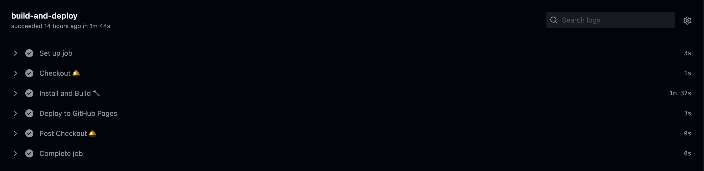

## 개요

[GitHub Action](https://docs.github.com/en/actions/reference/events-that-trigger-workflows)을 사용하여 깃허브 페이지 배포를 자동화하는 방법을 알아보자.

## Workflows

`workflow` 는 하나 이상의 작업으로 구성된 자동화 프로세스이다. 워크플로는 `.yml` 또는 `.yaml` 파일을 생성하여 구성할 수 있으며, 반드시 레포지토리의 `.github/workflows` 폴더에 저장되어야 한다. 구성 파일을 작성 방법은 [workflow syntax for github actions](https://docs.github.com/en/actions/reference/workflow-syntax-for-github-actions)에서 확인할 수 있으며, 이 포스트에서는 `on` 과 `jobs` 에 대해서만 간단히 알아보고, 배포 자동화를 위한 설정 파일을 제공한다. 배포 자동화를 위한 설정 파일만 보고 싶다면 [다음 단계](https://www.notion.so/GitHub-Pages-10af52b6102641f9822056a5ad83a844)로 넘어간다.

### on

워크플로를 트리거하는 이벤트의 이름을 설정일의 `on` 속성에 정의해야 한다. 사용할 수 있는 이벤트로는 `push` , `pull_request` 등이 있으며, 사용 가능한 이벤트 목록은 [Events that trigger workflows](https://docs.github.com/en/actions/reference/events-that-trigger-workflows)를 참고한다. 다음은 단일, 다중 이벤트를 정의한 구성파일의 예시이다.

```yaml
# 코드가 레포지토리 내의 브랜치에 푸시될 때 트리거
on: push
```

```yaml
# push 또는 pull request 이벤트가 발생될 때 트리거
on: [push, pull_request]
```

만일 특정 브랜치의 이벤트만 트리거하고 싶다면 다음과 같이 작성할 수 있다.

```yaml
on:
  # push 또는 pull request 이벤트가 발생시 트리거되지만,
  # main 브랜치가 아닌 경우는 제외 됨.
  push:
    branches:
      - main
  pull_request:
    branches:
      - main
```

### jobs

`on` 속성에 정의한 이벤트가 트리거 되었을 때 실행할 작업을 정의한다.

## 설정 파일

배포를 자동화하기 위해 `.github/workflows/github-pages-deploy.yml` 파일을 생성하고 다음과 같이 작성한다.

```yaml
name: Build and Deploy
on:
  push:
    branches:
      - main # main 브랜치에 push 이벤트가 발생하면 jobs가 실행된다.
jobs:
  build-and-deploy:
    runs-on: ubuntu-latest
    steps:
      - name: Checkout
        uses: actions/checkout@v2.3.1

      - name: Install and Build # npm을 사용하여 빌드하고 결과를 `build` 폴더에 출력한다.
        run: |
          npm install
          npm run build

      - name: Deploy
        uses: JamesIves/github-pages-deploy-action@4.1.5
        with:
          branch: gh-pages # 어느 브랜치에 작업 결과를 배포할지 지정한다.
          folder: build # 어떤 폴더를 배포할 것인지 지정한다.
```

배포 시에 사용하는 `JamesIves/github-pages-deploy-action@4.1.5` 는 포스트 작성 기준으로 최신버전이며, [deploy to github pages](https://github.com/marketplace/actions/deploy-to-github-pages) 페이지에서 최신 버전을 확인할 수 있다.

설정 파일 작성을 완료했다면 설정 파일을 커밋 후 깃허브에 푸시해보자. 푸시 후 해당 레포지토리의 `Actions` 탭에 들어가면 방금 커밋한 워크플로우가 추가된 것을 볼 수 있다. 이제 `main` 브랜치에 push 이벤트가 발생할 때마다 `Actions` 탭에서 다음과 같이 워크플로가 작동하는 것을 볼 수 있을 것이다.

