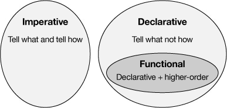

## 개요

자바 개발자는 보통 명령형 및 객체 지향 프로그래밍에 익숙하다. 자바가 처음 릴리즈 되었을 때부터 이러한 스타일을 제공했기 때문이다. 하지만 자바 8에서 함수형 프로그래밍을 위한 새로운 기능이 추가되며, 자바 개발자도 이를 알아야 할 필요가 생겼다. 함수형 프로그래밍은 일반적으로 객체 지향 프로그래밍보다 간결하고, 표현력이 뛰어나며, 오류가 덜 발생하고, 병렬화 하기도 쉽다. 이번 포스팅에서는 함수형 프로그래밍에 쉽게 접근하기 위한 방법을 알아본다.

## The imperative style (명령형 스타일)

명령형 스타일보다 선언형 스타일을 사용하게 되면 함수형 프로그래밍 스타일로 전환하는 데 도움이 된다. 명령형 스타일과 선언형 스타일이 무엇인지, 어떻게 다른지 알아보자. 다음은 주어진 리스트에 "Nemo"라는 문자열이 포함되어 있는지를 확인하는 코드를 명령형 스타일로 작성한 것이다.

```java

import java.util.*;

public class FindNemo {
  public static void main(String[] args) {
    List<String> names = 
      Arrays.asList("Dory", "Gill", "Bruce", "Nemo", "Darla", "Marlin", "Jacques");

    findNemo(names);
  }                 
  
  public static void findNemo(List<String> names) {
    boolean found = false;
    for(String name : names) {
      if(name.equals("Nemo")) {
        found = true;
        break;
      }
    }
    
    if(found)
      System.out.println("Found Nemo");
    else
      System.out.println("Sorry, Nemo not found");
  }
}
```

주어진 이름 목록에서 "Nemo"라는 문자열을 찾았는지 확인 위해 플래그 값을 선언한다. 이후 주어진 이름 목록을 순환하며 "Nemo"와 같은지 확인한다. 만약 값이 일치한다면 플래그를 `true` 로 설정하고 반복을 중단한다. 이렇게 프로그램이 무엇을 해야하는지, 어떻게 해야하는지에 대한 모든 단계를 지시하는 것이 명령형 스타일 방식이다.

## The declarative style (선언형 스타일)

선언형 스타일은 프로그램에서 수행할 작업을 지시한다는 점에서 명령형 프로그래밍과 같지만, 구현의 세부 사항은 기본 라이브러리 함수를 사용한다는 것에 차이가 있다. 다음은 선언형 스타일을 사용하여 `findNemo` 메서드를 작성한 것이다.

```java
public static void findNemo(List<String> names) {
    if(names.contains("Nemo"))
        System.out.println("Found Nemo");
    else
        System.out.println("Sorry, Nemo not found");
    }
```

이 코드에는 플래그 값이 존재하지 않으며, 반복문도 보이지 않는다. 내장된 `contains()` 메서드를 사용했기 때문이다. 여전히 프로그램에서 무엇을 해야하는지 (컬렉션에 "Nemo"라는 문자열이 있는지 확인)는 지시하지만, 어떻게 해야하는 지의 세부 사항은 구현하지 않고 `contains()`라는 기본 메서드를 사용하였다.

함수형 프로그래밍은 이런 선언적 스타일을 기반으로 하기 때문에 이 방식에 익숙해지면 함수형 프로그래밍으로의 전환에 도움이 된다.

## The functional style

함수형 프로그래밍 스타일은 항상 선언적이다. 하지만 선언적 스타일이 모두 함수형 프로그래밍인 것은 아니다. 다음 그림은 명령형, 선언형, 함수형 스타일의 관계를 나타낸다. 



### Higher order functions (고차 함수)

위 그림에서 "higher-order" 라는 단어가 나온다. 자바에서 고차함수(Higher order functions)란 함수(메서드)를 매개변수로 사용하거나, 실행 후 함수를 반환하는 함수를 말한다. 이런 고차함수를 사용한 것이 함수형 프로그래밍 스타일이다. 예시 코드를 통해 선언적 스타일과 함수형 스타일을 비교해보자. 다음과 같이 페이지에 접근할 때마다 페이지 접속 횟수를 늘려주는 메서드가 있다.

### The imperative style

먼저 선언적 스타일을 사용한 코드이다.

```java
public class UseMap {
  public static void main(String[] args) {
    Map<String, Integer> pageVisits = new HashMap<>();            
    
    String page = "https://agiledeveloper.com";
    
    incrementPageVisit(pageVisits, page);
    incrementPageVisit(pageVisits, page);
    
    System.out.println(pageVisits.get(page));
  }
  
  public static void incrementPageVisit(Map<String, Integer> pageVisits, String page) {
    if(!pageVisits.containsKey(page)) {
       pageVisits.put(page, 0);
    }
    
    pageVisits.put(page, pageVisits.get(page) + 1);
  }
}
```

### The functional style

이 코드를 함수형 스타일로 변경하면 다음과 같다.

```java
public class UseMap {
    // ...
    
    public static void incrementPageVisit(Map<String, Integer> pageVisits, String page) {
        pageVisits.merge(page, 1, (oldValue, value) ‑> oldValue + value);
    }
}
```

`merge()` 는 세 가지 매개변수를 받는다. 첫 번째는 값을 업데이트 해야 하는 키이다. 두 번째는 해당 키가 존재하지 않을 때 사용할 초기 값이다. 세 번째는 맵의 현재 값과 병합할 두 번째 값을 매개변수로 갖는 함수이다. 이 코드에서는 두 매개변수의 합계를 반환하도록 하였다.

## 마무리

자바에서 함수형 프로그래밍 스타일을 사용하면 많은 이점을 얻을 수 있다. 코드가 간결해지고, 표현력이 좋아진다. 병렬 처리도 쉬워지며 일반적으로 객체 지향 코드보다 이해하기 쉽다. 명령형 프로그래밍 사고 방식을 선언적 프로그래밍 사고 방식으로 바꾸고, 함수형 프로그래밍 스타일을 사용해보자.

## 참조

[An easier path to functional programming in Java](https://developer.ibm.com/articles/j-java8idioms1/)
