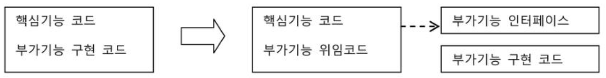
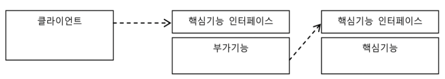
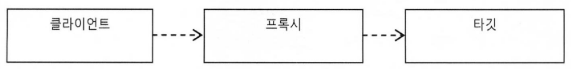
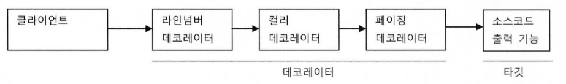
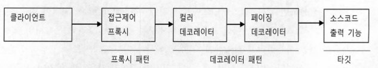

## 개요

트랜잭션 추상화 기법을 적용한 서비스를 리팩토링 해가며 프록시의 개념을 이해하고, 프록시를 활용한 디자인 패턴인 프록시 패턴과 데코레이터 패턴에 대해 알아보자.

## Service

[트랜잭션 서비스 추상화](/spring/abstract-transaction-model#user-service) 포스트에서 다음과 같은 유저 등급 설정 메서드를 만든 적이 있다.

```java
public class UserService {
	PlatformTransactionManager transactionManager = new DataSourceTransactionManager(dataSource);

	public void setTransactionManager(PlanformTransactionManager transactionManager) {
		this.trasactionManager = transactionManager;
	}

	public void upgradeLevels() {
		TransactionStatus status = transactionManager.getTransaction(new DefaultTransactionDefinition()); // 트랜잭션 시작
		try {
			// 비지니스 로직
			List<User> users = userDao.findAll();
			for (User user : users) {
				user.upgradeLevel();
				userDao.update(user);
			}

			transactionManager.commit(status); // 트랜잭션 커밋
		} catch (RunctimeException e) {
			transactionManager.rollback(status); // 트랜잭션 롤백
			throw e;
		}
	}
}
```

코드를 자세히 살펴보면 트랜잭션의 경계를 설정하는 코드와 비지니스 로직으로 구분할 수 있다. 이 두 가지 역할을 분리할 수 있지 않을까?

## 트랜잭션 분리

현재 코드는 `UserService` 클래스와 사용 클라이언트의 관계가 강한 결합도로 고정되어있다. 유연한 확장을 위해 인터페이스를 도입하고, 비지니스 로직과 트랜잭션 코드를 분리해보자.

### 인터페이스 도입

```java
public interface UserService {
	void upgradeLevels();
}
```

### 비지니스 로직

```java
public class UserServiceImpl implements UserService {
	@Override
	public void upgradeLevels() {
		List<User> users = userDao.findAll();
		for (User user : users) {
			user.upgradeLevel();
			userDao.update(user);
		}
	}
}
```

### 분리된 트랜잭션 기능

비지니스 로직을 분리하였으므로, 이제 트랜잭션 처리를 담은 `UserServiceTx`를 만들어보자.

```java
public class UserServiceTx implements UserService {
	UserService userService;
	PlatformTransactionManager transactionManager = new DataSourceTransactionManager(dataSource);

	public void setTransactionManager(PlanformTransactionManager transactionManager) {
		this.trasactionManager = transactionManager;
	}

	public void setUserService(UserService userService) {
		this.userService = userService;
	}

	public void upgradeLevels() {
		TransactionStatus status = transactionManager.getTransaction(new DefaultTransactionDefinition()); // 트랜잭션 시작
		try {
			userService.upgradeLevels();
			transactionManager.commit(status);
		} catch (RunctimeException e) {
			transactionManager.rollback(status);
			throw e;
		}
	}
}
```

이렇게 만든 `UserServiceTx`를 사용할 때에는 `UserServiceImpl` 을 주입하여 사용할 수 있다.   `UserServiceTx`는 트랜잭션의 경계설정을 맡고, 실제 처리는 주입된 `UserServiceImpl` 에게 위임하는 구조이다.

이렇게 코드를 분리하게 되면 얻을 수 있는 장점은 비지니스 로직을 담당하는 코드를 작성할 때 트랜잭션과 같은 기술적인 내용에 전혀 신경쓸 필요가 없다는 것이다.

JDBC나 JTA 같은 트랜잭션 API는 물론이고, 스프링의 트랜잭션 추상화 API 조차 사용하지 않아도 된다. 그저 트랜잭션 기능을 사용하고 싶다면 `UserServiceTx` 와 같이 트랜잭션 기능을 가진 오브젝트를 먼저 실행되도록 만들면 된다.

## 프록시

앞에서 트랜잭션 분리를 하기위해 사용했던 방법을 정리해보자. 먼저 비지니스 로직인 핵심 기능을 `UserServiceImpl` 로 분리하고, 트랙잭션이라는 부가 기능을 `UserServiceTx` 로 분리하였다. 이렇게 분리된 부가기능을 담은 클래스는, 부가 기능 이외의 나머지 기능을 핵심 기능을 가진 클래스로 위임한다.



문제는 클라이언트가 핵심 기능을 가진 클래스를 직접 사용해버리면, 부가 기능이 적용되지 않는다는 것이다. 이 문제를 해결하기 위해 인터페이스를 만들고, 부가 기능과 핵심 기능이 같은 인터페이스를 구현하도록 만든 것이다. 클라이언트는 인터페이스만 보고 사용하기 때문에 핵심 기능을 사용한다고 생각하지만 사실 부가 기능을 통해 핵심 기능을 이용하게 된다.



이렇게 클라이언트가 사용하려고 하는 실제 대상인 것처럼 위장하여 클라이언트의 요청을 받아주는 것을 **프록시**라고 부른다. 그리고 프록시를 통해 최종적으로 처리하는 실제 오브젝트를 **타깃** 또는 **실체**라고 부른다.



프록시는 사용 목적에 따라 두 가지로 구분 된다.

1. 클라이언트가 타깃에 접근하는 방법을 제어
2. 타켓에 부가적인 기능을 부여

여기서 말하는 프록시란 디자인 패턴에서 사용하는 프록시 패턴과는 다르다. 디자인 패턴에서는 프록시의 사용 목적에 따라 첫 번째 목적을 위해 사용될 경우를 **프록시 패턴**, 두 번째 목적을 위해 사용될 경우를 **데코레이터 패턴**이라고 한다.

### 데코레이터 패턴

데코레이터 패턴은 타깃에 **부가적인 정보를 부여해주기 위해 프록시를 사용**하는 패턴을 말한다. 데코레이터 패턴에서는 프록시가 꼭 한 개로 제한되지 않는다. 프록시가 여러 개일 경우 순서를 정하여 단계적으로 위임하는 구조로 만들면 된다.

예를들어 소스코드를 출력하는 핵심 기능에 라인 넘버를 붙여준다거나, 문법에 따라 색을 변경해주거나, 특정 폭으로 소스를 잘라주는 등의 부가 기능을 붙인다면 다음 그림과 같이 조합하여 사용할 수 있다.



자바 IO 패키지의 `InputStream` 과 `OutputStream` 의 구현 클래스는 데코레이터 패턴이 적용된 대표적인 예이다.

```java
InputStream is = new BufferedInputStream(new FileInputStream("a.txt"));
```

앞에서 살펴본 `UserServiceImpl` 과 `UserServiceTx` 기능을 분리하는데 사용했던 방법도 데코레이터 패턴이다. 데코레이터 패턴은 타깃의 코드를 변경하지 않고, 클라이언트가 호출하는 방법도 변경하지 않은 채 로 새로운 기능을 추가할 때 유용하다.

### 프록시 패턴

프록시 패턴은 타깃**의 접근 방법을 제어하기 위해 프록시를 사용**하는 패턴을 말한다. 프록시 패턴에서 사용되는 프록시는 타깃의 기능을 확장하거나 추가하지 않는다. 대신 타깃에 접근하는 방식을 변경해준다. `Collections` 의 `unmodifiableCollection()` 메서드를 예로 들수 있다. 다음 코드를 살펴보자.

```java
List<Integer> list = Collections.unmodifiableList(Arrays.asList(1, 2, 3));
list.add(4);
```

이 코드를 테스트 해보면 `list.add(4)` 에서 `UnsupportedOperationException` 이 발생한다. `unmodifiableCollection()` 메서드는 파라미터로 전달된 `Collection` 오브젝트의 프록시를 만들어서, `add()` `remove()` 같이 정보를 수정하는 메서드를 호출할 경우 `UnsupportedOperationException` 를 발생시키기 때문이다.

이렇게 프록시 패턴은 타깃의 기능에는 관여하지 않으면서 접근하는 방법을 제어해주는 프록시를 이용하는 것이다. 물론 프록시 패턴도 인터페이스를 통해 기능을 위임하도록 만들어 데코레이터 패턴과 함께 적용할 수 있다.



## 프록시의 문제점

프록시는 기존 코드에 영향을 주지 않으며 타깃의 기능을 확장하거나 접근 방법을 제어할 수 있는 유용한 방법이지만, 몇 가지 문제점이 있다.

첫 번째 문제는 프록시를 만드는 것이 상당히 번거롭다는 것이다. 매번 새로운 클래스를 정의해야 하고, 인터페이스에 구현해야 할 메소드가 많다면 일일히 구현해서 위임하는 코드를 작성해야 하기 때문이다.

두 번째 문제는 부가기능 코드가 중복될 가능성이 많다는 것이다. 앞에서 살펴본 `UserService` 에 `add()` 라는 메서드를 추가하고 싶고, 이 메서드에 트랜잭션 기능을 추가해야 한다고 하자. 그렇다면 `add()` 메서드에도 `upgradeLevels()` 와 동일한 트랜잭션 경계설정 코드가 작성될 것이다.

두 번째 문제는 코드 분리를 통해 어떻게든 해결한다고 하고, 첫 번째 문제는 어떻게 해결할 수 있을까?

[다음 포스트](/spring/proxy-2-dynamic-proxy)를 통해 해결 방법을 알아보자.