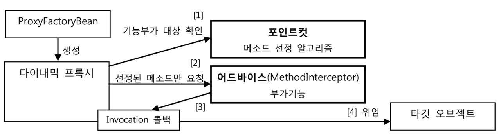
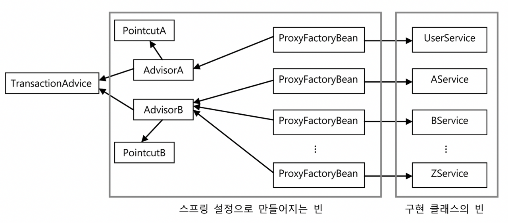
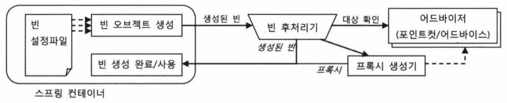

## 개요

[이전 포스트](/spring/proxy-2-dynamic-proxy)에서 프록시 팩토리와 한계점에 관하여 알아보았다. 이번 포스트에서는 이러한 한계점을 스프링은 어떤 방식으로 해결책을 제시하였는지 알아보자.

## ProxyFactoryBean

스프링은 프록시 오브젝트를 생성해주는 기술을 추상화한 팩토리 빈을 제공해준다. `ProxyFactoryBean` 이 스프링에서 제공해주는 팩토리 빈이다. `FactoryBean<T>` 을 상속받아서 구현했던 [TxProxyFactoryBean](https://www.notion.so/2-439670511c854cd4860a7c9226041826)과 달리 `ProxyFactoryBean` 는 순수하게 프록시를 생성하는 작업만을 담당하고, 프록시를 통해 제공해줄 부가기능은 별도의 빈에 둘 수 있다.

## MethodInterceptor

`ProxyFacctoryBean` 이 생성하는 프록시에서 사용할 부가기능은 `MethodInterceptor` 인터페이스를 구현하여 만든다. `MethodInterceptor` 는 `InvocationHandler` 와 비슷하지만 한 가지 차이가 있다. `InvocationHandler` 의 `invoke()` 메서드는 타깃 오브젝트에 대한 정보를 제공하지 않는다. 따라서 `InvocationHandler` 를 구현한 클래스에서 타깃에 대한 정보를 직접 알고있어야 한다. 하지만 `MethodInterceptor` 의 `invoke()` 메서드는 `ProxyFactoryBean` 으로부터 타깃 오브젝트에 대한 정보를 함께 제공받는다. 이 차이로 `MethodInterceptor` 는 타깃 오브젝트에 상관 없이 독립적으로 만들어 질 수 있다. 따라서 타깃이 다른 여러 프록시에서 함께 사용할 수 있으며, 싱글톤 빈으로 등록 가능하다.

## ProxyFactoryBean 적용

스프링이 제공하는 `ProxyFactoryBean` 을 이용하도록 수정해보자.

### 어드바이스

먼저 [InvocationHandler](/proxy-2-dynamic-proxy#transaction-handler)를 구현했던 코드를 `MethodInterceptor` 를 구현하도록 변경한다.

```java
public class TransactionAdvice implements MethodInterceptor {
	PlatformTransactionManager transactionManager;

	public void setTransactionManager(PlatformTransactionManager transactionManager) {
		this.transactionManager= transactionManager;
	}

	@Override
	public Object invoke(MethodInvocation invocation) throw Throwable {
		TransactionStatus status = transactionManager.getTransaction(new DefaultTransactionDefinition());

		try {
			Object ret = invocation.proceed(); // 콜백을 호출하여 타깃의 메서드를 실행
			transactionManager.commit(status);
			return ret;
		} catch (RuntimeException e) {
			transactionManager.rollback(status);
			throw e;
		}
	}
}
```

앞서 설명했듯이, `MethodInterceptor` 의 `invoke()` 메서드는 `ProxyFactoryBean` 으로부터 타깃에 대한 정보까지 함께 제공받는다. `MethodInvocation` 의 `proceed()` 메서드를 실행하면 타깃 오브젝트의 메서드를 내부적으로 실행해준다. 이렇게 매개변수로 `MethodInvocation` 이라는 타깃 정보를 전달받기 때문에, `InvocationHandler` 를 이용했을때보다 훨씬 간결해졌다. 타깃 메서드가 던지는 예외도 `InvocationTargetException` 으로 포장되는 것이 아니기 때문에 그대로 잡아서 처리하면 된다.

부가기능을 만들었다면 다음과 같이 사용할 수 있다.

```java
ProxyFactoryBean pfBean = new ProxyFactoryBean();
pfBean.setTarget(userService);
pfBean.addAdvice(new TransactionAdvice());

UserService userService = (UserService) pfBean.getObject();
userService.upgradeLevels();
```

코드에서 보는 것처럼 `ProxyFactoryBean` 은 `addAdvice()` 메서드를 통해 여러 개의 `MethodInterceptor` 를 추가할 수 있다. 이전 포스트에서 살펴봤던 프록시 팩토리 빈의 단점 중 하나였던, 새로운 부가기능을 추가할 때마다 프록시와 프록시 팩토리 빈을 추가해야 한다는 문제를 해결 할 수 있다.

메서드 이름을 보면 addMethodInterceptor가 아니라 `addAdvice` 인데, 이는 `MethodInterceptor` 가 `Advice` 인터페이스를 상속하고 있는 서브 인터페이스이기 때문이다. 이름에서 알 수 있 듯이 스프링에서는 타깃 오브젝트에 적용하는 부가기능을 담은 오브젝트를 **어드바이스**라고 부른다.

### 포인트컷

기존에 `InvocationHandler` 를 직접 구현했을 때는 부가기능 적용 외에도 한 가지 기능이 더 있었다. 메서드의 이름을 가지고 부가기능 적용 대상 메서드를 선정하는 것이었다. 앞에서 만들어본 어드바이스에는 이 기능이 빠져있다. `MethodInterceptor` 은 타깃 정보가 없어 여러 프록시에서 공유할 수 있다고 하였는데, 특정 프록시에만 적용되는 메서드 선정 알고리즘을 넣으면 이런 장점이 사라지기 때문이다. 스프링은 이러한 문제를 해결하기 위해 부가기능 선정 기능인 어드바이스와, 메서드 선정 알고리즘을 정하는 기능을 아예 구분하였다. 메서드 선정 알고리즘을 담은 오브젝트는 **포인트컷**이라고 부른다. 앞서 만든 어드바이스에 포인트컷을 적용한 코드는 다음과 같다.

```java
ProxyFactoryBean pfBean = new ProxyFactoryBean();
pfBean.setTarget(userService);

NameMatchMethodPointcut pointcut = new NameMatchMethodPointcut();
pointcut.setMappedName("upgrade*");
pfBean.addAdvicor(new DefaultPointcutAdvisor(pointcut, new TransactionAdvice()));

UserService userService = (UserService) pfBean.getObject();
userService.upgradeLevels();
```

`ProxyFactoryBean` 을 이용한 방식의 작업 흐름은 다음 그림과 같다.



포인트컷을 적용하기 전에는 `addAdvice()` 로 어드바이스만 등록하면 됐다. 하지만 포인트컷을 함께 등록할 때에는 `Advisor` 타입으로 묶어 `addAdvisor()` 메서드를 호출해야한다. 그 이유는 `ProxyFactoryBean` 에 여러 개의 어드바이스와 포인트컷이 추가될 수 있기 때문인데, 포인트컷과 어드바이스를 따로 등록하게되면 어떤 어드바이스에 어떤 포인트컷을 적용할지 애매해지기 때문이다. 메서드 이름에서도 알 수 있듯 포인트컷과 어드바이스를 묶은 오브젝트를 인터페이스 이름을 따서 **어드바이저**라고 부른다.

### 빈 설정

`ProxyFactoryBean` 을 사용한 코드를 작성해보았으니, 이제 빈 설정을 해보자.

```xml
<bean id="transactionAdvice" class="springbook.user.service.TransactionAdvice">
	<property name="transactionManager" ref="transactionManager"/>
</bean>
```

```xml
<bean id="transactionPointcut" class="org.springframework.aop.support.NameMatchMethodPointcut">
	<property name="mappedName" value="upgrade*"/>
</bean>
```

```xml
<bean id="transactionAdvisor" class="org.springframework.aop.support.DefaultPointcutAdvisor">
	<property name="advice" ref="transactionAdvice"/>
	<property name="pointcut" ref="transactionPointcut"/>
</bean>
```

```xml
<bean id="userService" class="org.springframework.aop.framework.ProxyFactoryBean">
	<property name="target" ref="userServiceImpl"/>
	<property name="interceptorNames">
		<list>
			<value>transactionAdvisor</value>
		</list>
	</property>
</bean>
```

## 어드바이스와 포인트컷의 재사용

`UserService` 외에 새로운 서비스 클래스가 만들어져도 이미 만들어둔 `TransactionAdvice` 를 그대로 사용할 수 있다. 메소드 선정을 위한 포인트컷이 필요하면 이름 패턴만 지정해서 `ProxyFactoryBean` 에 등록해주면 된다. 다음은 `ProxyFactoryBean` 을 이용하여 많은 수의 서비스 빈에게 트랜잭션 부가기능을 적용한 모습이다. `TransactionAdvice` 는 하나만 만들어서 싱글톤 빈으로 등록해주면, DI 설정을 통해 모든 서비스에 적용이 가능하다.



여기서 한 가지 의문이 들 수 있다. 부가기능은 한 번만 만들어 모든 타깃과 메서드에 재사용 가능하고, 타깃의 적용 메서드를 선정하는 방식도 독립적으로 분리하였지만, 새로운 서비스가 생길때마다 ProxyFactoryBean 빈 설정 정보를 추가해줘야 한다는 것이다. 다이내믹 프록시가 인터페이스만 제공하면 모든 메서드에 대한 구현클래스를 자동으로 만들듯이, 일정한 타깃 빈의 목록을 제공하면 자동으로 각 타깃 빈에 대한 프록시를 만들 수는 없을까?

## 빈 후처리기

빈 후처리기는 `BeanPostProcessor` 인터페이스를 구현해서 만들며, 이름 그대로 스프링 빈 오브젝트가 만들어진 후에 빈 오브젝트를 다시 가공할 수 있게 해준다.

### 자동 프록시 생성기

스프링이 제공하는 빈 후처리기 중 하나인 `DefaultAdvisorAutoProxyCreator` 를 잘 이용하면, 스프링이 생성하는 빈 오브젝트의 일부를 프록시로 보장하고, 프록시를 빈으로 대신 등록할 수 있다. 다음 그림은 빈 후처리기를 이용한 자동 프록시 생성 방법을 설명한다.



그림과 같이 `DefaultAdvisorAutoProxyCreator` 는 빈으로 등록된 모든 어드바이저 내의 포인트컷을 이용하여 전달받은 빈이 프록시 적용 대상인지 확인한다. 프록시 적용 대상이라면 내장된 프록시 생성기에게 현재 빈에 대한 프록시를 만들게 하고, 만들어진 프록시에 어드바이저를 연결해준다. 이렇게 프록시가 생성되면 컨테이너가 전달해준 빈 오브젝트 대신 생성된 프록시 오브젝트를 컨테이너에게 돌려주며, 최종적으로는 빈 후처리기가 돌려준 오브젝트를 빈으로 등록하고 사용한다. 이를 잘 활용하면 ProxyFactoryBean 설정 문제를 해결할 수 있다.

### DefaultAdvisorAutoProxyCreator의 적용

자동 프록시 생성기에 대해 알아보았으니, 실제로 적용해보자. 적용하기 전에 포인트컷에 대해 추가로 알아야 할 내용이 있다. 앞서 포인트컷은 어드바이스를 적용할 메서드를 선정해주는 역할을 한다고 했는데, 사실 이 기능 외에도 프록시를 적용할 클래스인지 확인해주는 기능도 갖고 있다.

```java
public interface Pointcut {
	ClassFilter getClassFilter(); // 프록시를 적용할 클래스인지 확인해준다.
	MethodMatcher getMethodMatcher(); // 어드바이스를 적용할 메서드인지 확인해준다.
}
```

우리가 사용했던 `NameMatchMethodPointcut` 은 메서드 선별 기능만 가진 특별한 포인트컷이다. 메서드 선별 기능만 가졌다는 것은 클래스 필터가 모든 클래스를 다 받아주도록 만들어져 있다는 뜻이다. 우리는 `NameMatchMethodPointcut` 을 상속하여 다음과 같은 클래스 필터 기능이 추가된 포인트컷을 만들 것이다.

```java
public class NameMatchClassMethodPointcut extends NameMatchMethodPointcut {
	public void setMappedClassName(String mappedClassName) {
		this.setClassFilter(new SimpleClassFilter(mappedClassName));
	}

	static class SimpleClassFilter implements ClassFilter {
		String mappedName;

		private SimpleClassFilter(String mappedName) {
			this.mappedName = mappedName;
		}

		public boolean matches(Class<?> clazz) {
			return PatternMatchUtils.simpleMatch(mappedName, clazz.getSimpleName());
		}
	}
}
```

그리고 자동 프록시 생성기인 `DefaultAdvisorAutoProxyCreator` 를 빈으로 등록한다.

```xml
<bean class="org.springframework.aop.framwork.autoproxy.DefaultAdvisorAutoProxyCreator"/>
```

이 빈 정의에는 id 속성이 없고 class 속성만 존재하는데, 다른 빈에서 참조되거나 코드에서 빈 이름으로 조회될 필요가 없는 빈이라면 아이디를 등록하지 않아도 된다.

이제 앞에서 설정하였던 포인트컷 빈 설정을 다음과 같이 바꾼다.

```xml
<bean id="transactionPointcut" class="springbook.service.NameMatchClassMethodPointcut">
	<property name="mappedClassName" value="*ServiceImpl"/>
	<property name="mappedName" value="upgrade*"/>
</bean>
```

더 이상 명시적인 프록시 팩토리 빈을 등록하지 않아도 되기 때문에 ProxyFactoryBean 타입의 빈은 삭제한다. UserService와 관련된 빈 설정은 이제 다음 같은 설정으로 충분하다.

```xml
<bean id="userService" class="springbook.service.UserServiceImpl">
	<property name="userDao" ref="userDao"/>
</bean>
```