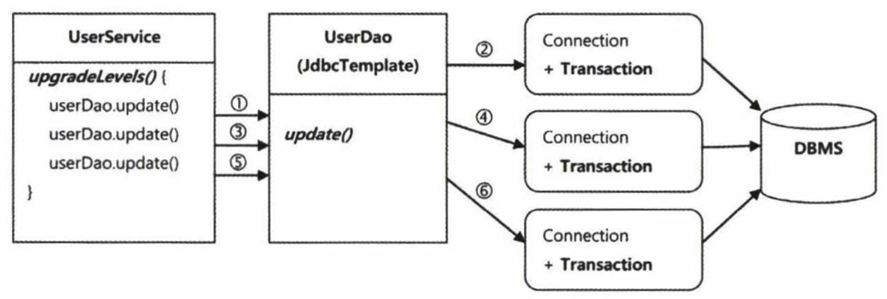
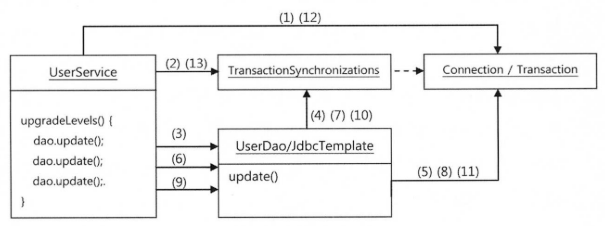
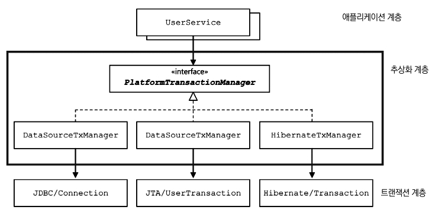

## 개요

트랜잭션 기능을 사용한 서비스를 리팩토링 해가며 스프링에서 트랜젝션 서비스를 어떤 방식으로 제공해 주는지 알아보자.

## Service

다음과 같이 사용자의 등급을 올리는 서비스 메서드가 있다고 하자.

```java
public class UserService {
    public void upgradeLevels() {
        List<User> users = userDao.findAll();
        for (User user : users) {
            user.upgradeLevel();
            userDao.update(user);
        }
    }
}
```

이 서비스는 작업을 수행하는 도중 오류가 발생하여도, 오류가 발생하기 전까지 변경된 사용자의 레벨은 변경된 상태로 유지된다. 오류가 발생할 경우 변경된 내용을 모두 원 상태로 되돌리고 싶다면 트랜잭션 기능을 도입해야 할 것이다.

## 트랜잭션 경계 설정

모든 트랜잭션은 시작 지점과 끝나는 지점이 있다. 어플리케이션 내에서 트랜잭션이 시작되고 끝나는 위치를 트랜잭션 경계라고 부른다. 다음은 JDBC를 사용하여 트랜잭션을 적용하는 예제이다.

```java
try (Connection c = dataSource.getConnection()) {
    c.setAutoCommit(false); // 트랜잭션 시작

    PreparedStatement pstmt1 = c.prepareStatement("update users ...");
    pstmt1.executeUpdate();

    PreparedStatement pstmt2 = c.prepareStatement("delete users ...");
    pstmt2.executeUpdate();

    c.commit(); // 트랜잭션 커밋
} catch(Exception e) {
    c.rollback(); // 트랜잭션 롤백
}
```

이렇게 `setAutoCommit(false)` 로 트랜잭션을 시작하고 `commit()` 또는 `rollback()` 을 사용하여 트랜잭션을 종료하는 작업을 **트랜잭션의 경계설정**이라고 한다.

## 트랜잭션 도입시 문제점 1

스프링의 `JdbcTemplate` 은 내부적으로 getConnection() 메서드를 호출하여 Connection 오브젝트를 가져오고, 작업이 종료될 때 Connection을 닫는다. 앞에서 작성한 [UserService](#Service)에 사용된 UserDao에 JdbcTemplate을 사용했다고 한다면, UserDao는 각 메서드마다 독립적인 트랜잭션으로 실행될 수 밖에 없다.



이 문제를 해결하려면 UserService에서 Connection 객체를 생성하고, UserDao 메서드로 생성된 Connection을 파라미터로 전달해 같은 Connection을 사용하도록 해야한다. 이렇게 변경된 코드는 다음과 같을 것이다.

```java
public class UserService {
    public void upgradeLevels() {
        try (Connection c = ...) {
            c.setAutoCommit(false);
            List<User> users = userDao.findAll();
            for (User user : users) {
                user.upgradeLevel();
                userDao.update(c, user); // dao로 connection 전달
            }
            c.commit();
        } catch (Exception e) {
            c.rollback();
            throw e;
        }
    }
}
```

이렇게 적용하면 문제가 해결된 것일까?

## 트랜잭션 도입시 문제점 2

코드를 변경하여 트랜잭션 문제를 해결할 수 있겠지만, 그 이외의 여러 문제점이 생겼다.

첫번째 문제는 `JdbcTemplate` 을 더 이상 사용하지 못하게 된다는 것이다. 결국 JDBC API 를 직접 사용해야 하는 고전적인 방식을 사용해야 한다.

두번째 문제는 DAO 메서드에 Connection 파라미터가 추가돼야 한다는 것이다. 클라이언트에서 `upgradeLevels()` 메서드를 사용하고 싶다면, 그 사이에 모든 메서드에 걸쳐서 Connection 객체가 전달 되어야 한다.

세번째 문제는 UserDao가 더 이상 데이터 액세스 기술에 독립적이지 않다는 것이다. UserDao가 JDBC가 아닌 JPA로 구현 방식을 변경하고 싶다면 Connection 대신 EntityManager를 전달 받도록 변경해야 한다.

## 문제 해결 1 - 트랜잭션 동기화

스프링에서는 Connection을 파라미터로 전달하는 문제를 해결하기위해 **트랜잭션 동기화** 방식을 사용한다. 트랜잭션 동기화란 트랜잭션을 위해 생성한 Connection 객체를 특별한 저장소에 보관해두고, 이후에 `JdbcTemplate`이 사용될 때 저장된 Connection을 가져다가 사용하게 하는 것이다. 이후 모든 트랜잭션이 종료되면 그때 동기화를 마치면 된다.



다음은 트랜잭션 동기화를 적용한 코드이다.

```java
public void upgradeLevels() throws Exception {
    TransactionSynchronizationManager.initSynchronization(); // 트랜잭션 동기화 관리자를 사용해 동기화 작업 초기화
    Connection c = DataSourceUtils.getConnection(dataSource);
    c.setAutoCommit(false);

    try {
        ...
        commit();
    } catch (Exception e) {
        c.rollback();
        throw e;
    } finally {
        // DB 커넥션 닫기
        DataSourceUtils.releaseConnection(c, dataSource);

        // 동기화 작업 종료 및 정리
        TransactionSynchronizationManager.unbindResource(this.dataSource);
        TransactionSynchronizationManager.clearSynchronization();
    }
}
```

`DataSourceUtils` 에서 제공하는 `getConnection()` 메서드를 사용한 이유는 이 메서드가 Connection 객체를 반환할 뿐만 아니라 트랜잭션 동기화에 사용하도록 저장소에 바인딩 하는 역할을 해주기 때문이다.

`JdbcTemplate` 은 트랜잭션 동기화를 시작해 놓았다면 새로운 DB 커넥션을 만드는 대신 트랜잭션 동기화 저장소에 들어 있는 DB 커넥션을 가져와서 사용하도록 되어있다.

이렇게 트랜잭션 동기화를 통해 Connection 파라미터를 없앴지만, 여전히 문제가 남아있다. 트랜잭션 처리가 JDBC의 Connction을 사용하는 방식에 종속적이라는 것이다. 예를들어 두 개 이상의 DB에 데이터를 저장하는 작업을 하나의 트랜잭션으로 만들기 위해서는 JDBC의 Connection을 이용한 트랜잭션 방식인 로컬 트랜잭션으로는 불가능하다. 이를 해결하기 위해서는 글로벌 트랜잭션 방식을 사용해야 한다.

자바는 글로벌 트랜잭션을 지원하기 위한 API인 JTA를 제공한다. JTA를 이용한 트랜잭션 코드는 다음과 같다.

```java
InitialContext ctx = new InitailContext();
UserTransaction tx = (UserTransaction) ctx.lookup(USER_TX_JNDI_NAME);

tx.begin();
try (Connection c = dataSource.getConnection()) {
    tx.commit();
} catch (Exception e) {
    tx.rollback();
    throw e;
}
```

그렇다면 구현 기술이 바뀔때마다 코드를 수정해야 하는 걸까?

## 문제 해결 2 - 서비스 추상화

이러한 문제를 해결하기 위해 스프링에서는 트랜잭션 기술의 공통점을 담은 트랜잭션 추상화 기술을 제공한다. 이를 이용하여 각 기술의 트랜잭션 API를 이용하지 않고 일관된 방식으로 트랜잭션 제어가 가능하다.



스프링이 제공하는 트랜잭션 추상화 방법을 적용한 코드는 다음과 같다.

<div id="user-service">

```java
public class UserService {
    PlatformTransactionManager transactionManager;

    public void setTransactionManager(PlanformTransactionManager transactionManager) {
        this.trasactionManager = transactionManager;
    }

    public void upgradeLevels() {
        TransactionStatus status = transactionManager.getTransaction(new DefaultTransactionDefinition()); // 트랜잭션 시작
        try {
            List<User> users = userDao.findAll();
            for (User user : users) {
                user.upgradeLevel();
                userDao.update(user);
            }
            transactionManager.commit(status); // 트랜잭션 커밋
        } catch (RunctimeException e) {
            transactionManager.rollback(status); // 트랜잭션 롤백
            throw e;
        }
    }
}
```

</div>

스프링이 제공하는 트랜잭션 경계설정을 위한 추상 인터페이스는 `PlatformTransactionManager` 이다. JDBC의 로컬 트랜잭션을 사용한다면 `PlatformTransactionManager` 의 구현체인 `DataSourceTransactionManager` 를 사용하면 된다. 만약 글로벌 트랜잭션 사용을 위하여 JTA를 이용하도록 변경하고 싶다면 `DataSourceTransactionManager` 대신 `JTATransactionManager` 을 사용하도록 변경하면 된다.