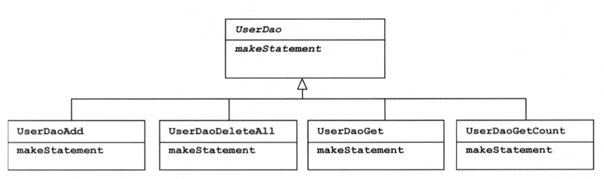
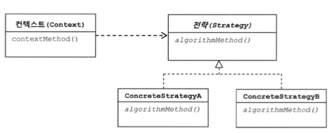

## 개요

JDBC를 사용한 코드의 문제점을 확인하고, 문제점을 하나씩 수정해가면서 템플릿/콜백 패턴을 이해해보자.

## DAO

JDBC를 사용해본 경험이 있다면 다음과 같은 코드를 본 기억이 있을 것이다.

```java
public void deleteAll() throws SQLException {
    Connection c = null;
    PreparedStatement ps = null;

    try {
        c = dataSource.getConnection();
        ps = c.prepareStatement("delete from users");
        ps.executeUpdate();
    } catch (SQLException e) {
        throw e;
    } finally {
        if (ps != null) {
            try { ps.close(); } catch (SQLException e) {}
        }
        if (c != null) {
            try { c.close(); } catch (SQLException e) {}
        }
    }
}
```

자바 7 이상 버전이라면 `try-with-resources` 를 사용해야겠지만, 앞으로 설명할 템플릿 콜백 패턴을 더 잘 설명하기 위해 이와 같은 코드를 작성하였다. 이 코드는 예외 처리를 하여 예외 상황에서도 안전하게 사용할 수 있지만 몇 가지 문제점이 있다.

## JDBC try/catch/finally 코드의 문제점

가장 눈에 띄는 문제는 복잡한 `try/catch/finally` 블록이 2중으로 중첩이 된다는 것이다. 현재는 `deleteAll()` 메서드 하나이지만, 다른 메서드가 추가 된다면 동일한 형태의 `try/catch/finally` 블록도 함께 추가되어야 한다. 실수로라도 finally 블록의 `c.close()` 라인을 빼먹게 되면 커넥션이 반환되지 않을 것이고, 어느순간 DB 커넥션 풀이 꽉 찾다는 에러를 내면서 서비스가 중단되는 문제까지 발생할 수 있다.

## 템플릿 메서드 패턴 적용

이런 경우 가장 먼저 생각할 수 있는 방법은 템플릿 메서드 패턴을 이용하는 것이다. 템플릿 메서드 패턴이란 **변하지 않는 부분을 부모 클래스에 두고, 변하는 부분은 추상 메서드로 정의하여, 자식 클래스에서 오버라이드하여 사용**할 수 있도록 하는 것이다. 템플릿 메서드 패턴을 이용하여 분리해보자.

```java
public abstract class UserDao {
    abstract protected PreparedStatement makeStatement(Connection c) throws SQLException;

    public void executeQuery() throws SQLException {
        Connection c = null;
        PreparedStatement ps = null;

        try {
            c = dataSource.getConnection();
            ps = makeStatement(c);
            ps.executeUpdate();
        } catch (SQLException e) {
            throw e;
        } finally {
            // 생략
        }
    }
    ...
}
```

```java
public class UserDaoDeleteAll extends UserDao {
    protected PreparedStatement makeStatement(Connection c) throws SQLException {
        PreparedStatement ps = c.prepareStatement("delete from users");
        return ps;
    }
}
```

이제 기능을 추가하고 싶을 때마다 UserDao 클래스의 변경 없이, 상속을 통하여 자유롭게 확장할 수 있게 되었다. 개방 폐쇄 원칙을 나름대로 지키는 구조인 것 같다. 하지만 이 코드는 DAO 로직이 추가될때마다 상속을 통해 새로운 클래스를 만들어야 한다는 문제점이 있다.



이 방식을 사용한다면 JDBC를 사용하는 메서드의 개수만큼 서브 클래스를 만들어야한다. 또 확장 구조가 클래스를 설계하는 시점에서 고정되어버려 유연성이 떨어진다. 이 문제를 어떻게 해결할 수 있을까?

## 전략 패턴 적용

전략 패턴은 **오브젝트를 아예 둘로 분리하고 클래스 레벨에서는 인터페이스를 통해서만 의존하도록 만들어** 템플릿 메서드 패턴보다 유연하고 확장성이 뛰어나다.



`deleteAll()` 메서드에서 변하지 않는 부분을 Context, 변하는 부분을 Strategy로 분리하여 전략 패턴을 적용해보자.

```java
public interface StatementStrategy {
    PreparedStatement makePreparedStatement(Connection c) throws SQLException;
}
```

```java
public class DeleteAllStatement implements StatementStrategy {
    public PreparedStatement makePreparedStatement(Connection c) throws SQLException {
        PreparedStatement ps = c.prepareStatement("delete from users");
        return ps;
    }
}
```

```java
public void jdbcContextWithStatementStrategy(StatementStrategy stmt) throws SQLException {
    Connection c = null;
    PreparedStatement ps = null;

    try {
        c = dataSource.getConnection();
        ps = stmt.makePreparedStatement(c);
        ps.executeUpdate();
    } catch (SQLException e) {
        throw e;
    } finally {
        if (ps != null) {
            try { ps.close(); } catch (SQLException e) {}
        }
        if (c != null) {
            try { c.close(); } catch (SQLException e) {}
        }
    }
}
```

```java
public void deleteAll() throws SQLException {
    StatementStrategy st = new DeleteAllStatement();
    jdbcContextWithStatementStrategy(st);
}
```

전략 패턴을 적용해보았으나, 아직까지는 큰 장점이 보이지 않는다. 템플릿 메서드 패턴을 적용했을때보다 유연성은 증가하였으나, DAO 메서드마다 새로운 StatementStrategy 구현 클래스를 만들어야하는 것은 변함이 없다. 또 삭제하기 위해 User 정보 등이 필요하다면, 생성자 등을 통해 User 정보를 제공받아야할 필요가 있다. 여기서 조금 더 발전시켜보자.

## 익명 클래스의 사용

앞선 문제를 해결하기 위해서 익명 클래스를 사용할 수 있다. 익명 클래스를 사용하도록 변경한 코드는 다음과 같다.

```java
public void deleteAll() throws SQLException {
    jdbcContextWithStatementStrategy(new StatementStrategy() {
        public PreparedStatement makePreparedStatement(Connection c) throws SQLException {
            PreparedStatement ps = c.prepareStatement("delete from users");
            return ps;
        }
    });
}
```

자바 8 이상을 사용한다면 다음과 같이 사용할 수 있다.

```java
public void deleteAll() throws SQLException {
    jdbcContextWithStatementStrategy(c -> c.prepareStatement("delete from users"));
}
```

## 클래스 분리

`jdbcContextWithStatementStrategy()` 메서드를 다른 DAO에서도 사용할 수 있도록 분리해보자.

```java
public class JdbcContext {
    private DataSource dataSource;

    public void setDataSource(DataSource dataSource) {
        this.dataSource = dataSource;
    }

    public void workWithStatementStrategy(StatementStrategy stmt) throws SQLException {
        Connection c = null;
        PreparedStatement ps = null;

        try {
            c = dataSource.getConnection();
            ps = stmt.makePreparedStatement(c);
            ps.executeUpdate();
        } catch (SQLException e) {
            throw e;
        } finally {
            if (ps != null) {
                try { ps.close(); } catch (SQLException e) {}
            }
            if (c != null) {
                try { c.close(); } catch (SQLException e) {}
            }
      }
    }
}
```

```java
public class UserDao {
    private JdbcContext jdbcContext;

    public void setJdbcContext(JdbcContext jdbcContext) {
        this.jdbcContext = jdbcContext;
    }

    public void deleteAll() throws SQLException {
        jdbcContext.workWithStatementStrategy(c -> c.prepareStatement("delete from users"));
    }
}
```

지금까지 만든 UserDao와 StatementStrategy, JdbcContext는 일종의 전략 패턴이 적용된 것이라고 볼 수 있다. 일정한 패턴을 갖는 작업 흐름이 존재하고, 그 중 일부만 자주 바꾸어 사용해야 하는 경우 적합한 패턴이다. 전략 패턴의 기본 구조에 익명 내부 클래스를 활용하는 방식을 스프링에서는 **템플릿/콜백 패턴**이라고 부른다.

## JdbcTemplate

`findAll()` 메서드를 추가하려고 보니, `deleteAll()` 메서드에서 쿼리만 바꿔주면 될 것 같은 느낌이 든다. `JdbcContext` 에 다음과 같은 메서드를 추가해주면 어떨까?

```java
public void executeSql(final String query) throws SQLException {
    workWithStatementStrategy(c -> c.prepareStatement(query));
}
```

그럼 다음과 같이 `deleteAll()` 메서드도 변경할 수 있을 것이다.

```java
public void deleteAll() throws SQLException {
    jdbcContext.executeSql("delete from users");
}
```

여태까지 템플릿과 콜백의 기본적인 원리와 작동 방식을 알아보았다. 스프링에서는 지금까지 만들어본 JdbcContext와 비슷한 JDBC용 기본 템플릿인 `JdbcTemplate` 를 제공한다. `JdbcTemplate` 를 적용한 코드는 다음과 같다.

```java
public class UserDao {
    private JdbcTemplate jdbcTemplate;

    public void setDataSource(DataSource dataSource) {
        this.jdbcTemplate = new JdbcTemplate(dataSource);
    }

    public void deleteAll() {
        jdbcTemplate.update(c -> c.prepareStatement("delete from users"));
    }
}
```

`JdbcTemplate` 은 우리가 만든 `JdbcContext` 보다 훨씬 더 강력한 기능을 제공한다. Spring 에서 `JdbcContext` 와 같은 기능을 직접 만들어 사용할 일은 없겠지만, 이 과정을 통해 `JdbcTemplate` 이 어떤 방식으로 만들어졌는지 이해할 수 있었다.