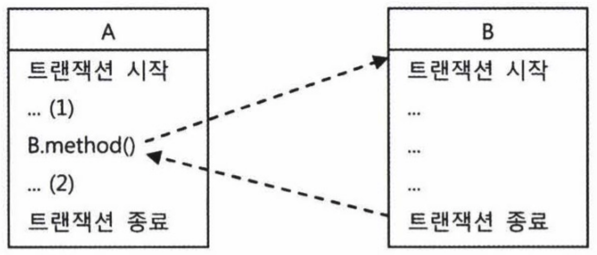

## 개요

트랜잭션은 더이상 쪼갤 수 없는 최소 단위의 작업이라는 사실에는 변함이 없지만, 트랜잭션이 모두 같은 방식으로 동작하는 것은 아니다. 스프링이 제공하는 `TransactionDefinition` 인터페이스는 트랜잭션의 동작 방식에 영향을 줄 수 있는 네 가지 속성을 정의하고 있다. 이를 이용해 트랜잭션의 동적방식을 제어할 수 있다. 기본적으로 사용하는 속성은 `DefaultTransactionDefinition` 이며, 자세한 내용은 이번 포스트를 통해 알아보자.

## 트랜잭션 속성

트랜잭션의 네 가지 속성인 트랜잭션 전파, 격리수준, 제한시간, 읽기전용에 대하여 알아보자.

### 트랜잭션 전파

트랜잭션 전파(transaction propagation)란 트랜잭셕의 경계에서 이미 진행중인 트랜잭션이 있을 때 또는 없을 때 어떻게 동작할 것인지에 대한 것이다. 다음 그림을 살펴보자.



A 트랜잭션이 시작되고 아직 끝나지 않은 상태에서 B 를 호출하였다. 이 경우 다음과 같은 시나리오가 존재할 수 있다.

1. B 트랜잭션이 A 트랜잭션에 참여
2. B 는 새로운 트랜잭션으로 동작

만약 앞 그림의 (2)에서 오류가 발생하였다고 해보자. 1번의 경우는 A와 B 트랜잭션 모두 롤백이 될 것이다. 2번의 경우는 B 트랜잭션은 롤백되지 않고, A 트랜잭션만 롤백될 것이다. 이렇게 B와 같이 독자적인 트랜잭션을 가진 코드에 대해 이미 실행중인 트랜잭션이 어떻게 영향을 미칠 수 있는지를 정의하는 것이 트랜잭션 전파 속성이다. 대표적인 트랜잭션 전파 속성을 살펴보자.

- PROPAGATION_REQUIRED
  진행 중인 트랜잭션이 없으면 트랜잭션을 새로 시작하고, 이미 시작된 트랜잭션이 있으면 이에 참여한다. `DefaultTransactionDefinition` 의 트랜잭션 전파 속성이 이 속성을 사용한다.
- PROPAGATION_REQUIRES_NEW
  항상 새로운 트랜잭션을 시작한다. 독립적인 트랜잭션이 보장돼야 하는 코드에 적용할 수 있다.
- PROPAGATION_NOT_SUPPORTED
  트랜잭션 없이 동작하도록 한다. 트랜잭션 경계설정은 보통 AOP를 이용해 한 번에 많은 메소드에 동시에 적용하는 방법을 사용한다. 이 중에 특정 메서드만을 제외하고 싶을 때 이 속성을 사용할 수 있다.

### 격리수준

서버 환경에서는 여러 개의 트랜잭션이 동시에 진행될 수 있으므로, 적절한 격리수준 설정이 필요하다. 격리수준은 기본적으로 DB에 설정되어 있지만, JDBC 드라이버나 DataSource 등에서 재설정 할 수 있다. 필요하다면 트랜잭션 단위로 격리수준을 조정할 수도 있다. `DefaultTransactionDefinition` 에 설정된 격리수준은 `ISOLATION_DEFAULT` 이며 이는 DataSource에 설정되어 있는 격리수준을 그대로 따른다는 뜻이다. 기본적으로는 DataSource에 설정된 디폴트 격리수준을 따르는 편이 좋지만, 특별한 작업을 수행하는 메서드의 경우 격리수준을 지정할 필요가 있다.

> **INFO**: 격리 수준에 관해 궁금하다면 [여기](/database/isolation-level)에서 확인할 수 있다.
>

### 제한시간

트랜잭션을 수행하는 제한시간(timeout)을 설정할 수 있다. `DefaultTransactionDefinition` 의 기본 설정은 제한시간이 없다. 제한시간 속성은 트랜잭션이 처음 시작될 때가 아니라면 적용되지 않기 때문에 트랜잭션을 직접 시작할 수 있는 `PROPAGATION_REQUIRED` 또는 `PROPAGATION_REQUIRES_NEW` 와 함께 사용해야만 의미가 있다.

### 읽기전용

읽기전용(read only)으로 설정하면 트랜잭션 내에서 데이터를 조작하는 시도를 막을 수 있다. 또 데이터 액세스 기술에 따라 성능이 향상되기도 한다. 제한시간 속성과 마찬가지로 트랜잭션이 처음 시작될 때가 아니라면 적용되지 않는다.

## 트랜잭션 속성 적용

이제 트랜잰션 속성을 적용하는 방법을 알아보자.

### 트랜잭션 경계설정의 일원화

트랜잭션 경계설정의 부가기능을 여러 계층에서 중구난방으로 적용하는 것은 좋지 않다. 일반적으로 비지니스 로직을 담고 있는 서비스 계층 오브젝트의 메소드가 트랜잭션 경계를 부여하기에 가장 적절하다. 서비스 계층을 트랜잭션의 경계로 정했다면, 다른 계층이나 모듈에서 DAO에 직접 접근하지 않고 서비스를 사용하도록 한다. 물론 순수한 조회나 간단한 수정이라면 DAO를 직접 사용해도 상관없다.

### 트랜잭션 속성을 가진 트랜잭션 어드바이스 등록

스프링에는 트랜잭션 경계설정 어드바이스로 사용할 수 있도록 `TransactionInterceptor` 를 제공한다. 이 어드바이스는 `PlatformTransactionManager` 와 `Properties` 타입의 프로퍼티를 갖고 있다. PlatformTransactionManager에 대해서는 [이 포스트](/toby-spring/transaction-definition)에서 설명한 적이 있다. Properties는 일종의 맵 타입 오브젝트이며, 이 속성을 통해 `TransactionAttribute` 를 전달 받는다. 트랜잭션 속성은 다음과 같은 문자열로 정의할 수 있다.

```xml
PROPAGATION_NAME, ISOLATION_NAME, readOnly, timeout_NNNN, -Exception1, +Exception2
```

- PROPAGATION_NAME: 트랜잭션 전파 방식. 필수항목이다. PROPAGATION_ 으로 시작한다.
- ISOLATION_NAME: 격리수준. 생략하면 디폴트 격리수준으로 지정된다.
- readOnly: 읽기전용 항목으로 생략 가능하다. 디폴트는 읽기 전용이 아니다.
- timeout_NNNN: 제한시간. timeout_으로 시작하고 초 단위를 뒤에 붙인다. 생략 가능하다.
- -Exception1: 체크 예외 중 롤백 대상으로 추가할 예외를 넣으며 한 개 이상 등록 가능하다.
- +Exception2: 런타임 예외지만 롤백시키지 않을  예외를 넣으며 한 개 이상 등록 가능하다.

이를 활용하여 트랜잭션 어드바이스를 등록하는 코드이다.

```xml
<bean id="transactionAdvice" class="org.springframework.transaction.interceptor.TransactionInterceptor">
	<property name="transactionManager" ref="transactionManager"/>
	<property name="transactionAttributes">
		<props>
			<prop key="get*">PROPAGATION_REQUIRED, readOnly</prop>
			<prop key="*">PROPAGATION_REQUIRED</prop>
		</props>
	</property>
</bean>
```

### 서비스 빈에 적용되는 포인트컷 표현식 등록

aop 스키마의 태그를 이용해 포인트것, 어드바이저 등의 설정을 만든다.

```xml
<aop:config>
	<aop:advisor advice-ref="transactionAdvice" pointcut="bean(*Service)"/>
</aop:config>
```

이렇게 설정을 등록하면 아이디가 Service로 끝나는 모든 빈에 transactionAdvice 빈의 부가기능이 적용된다.