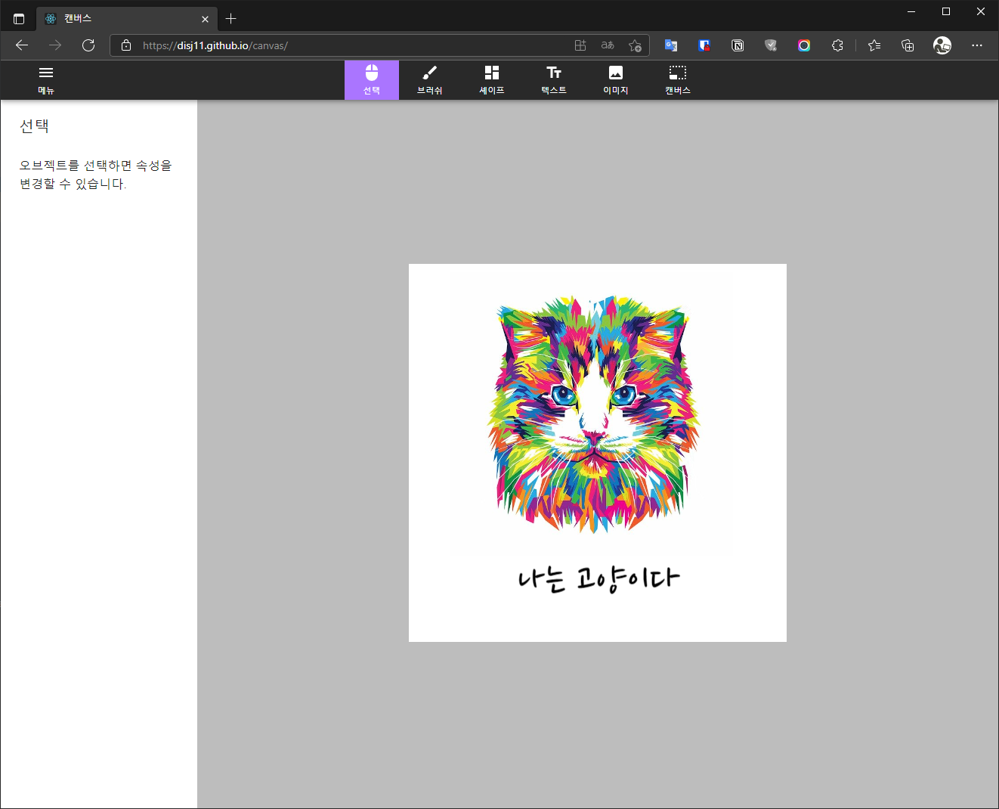
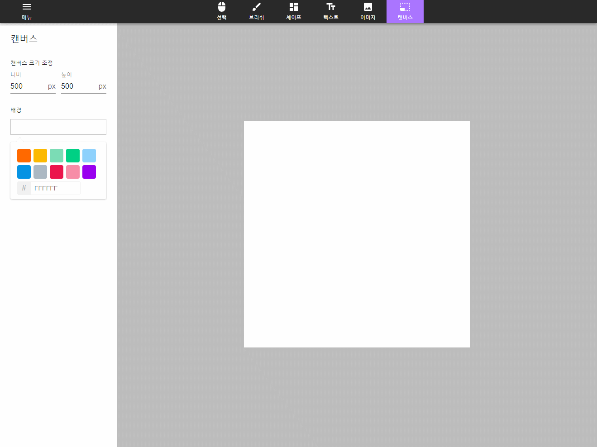
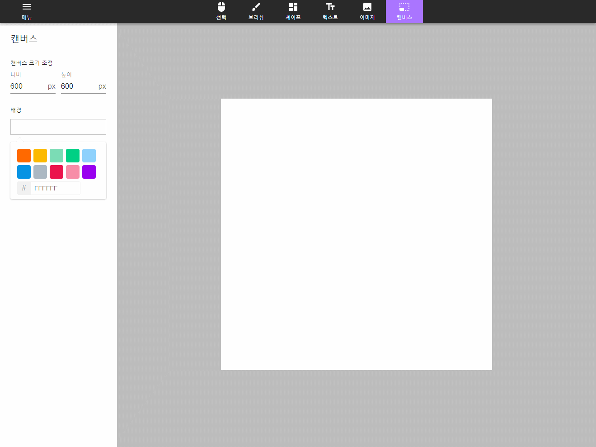
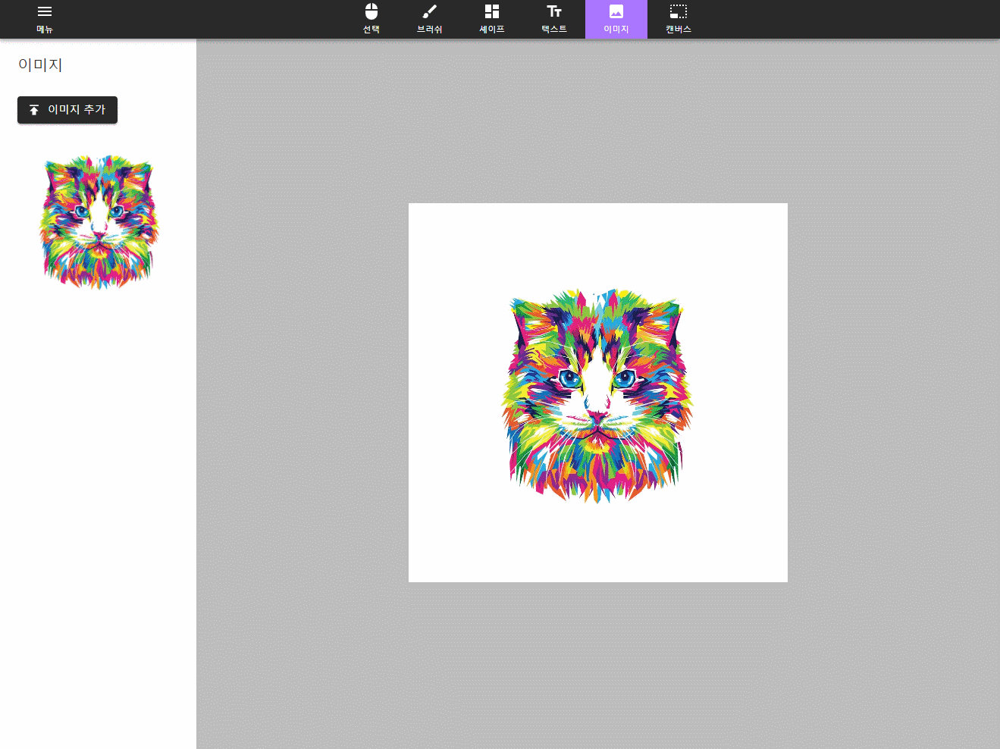
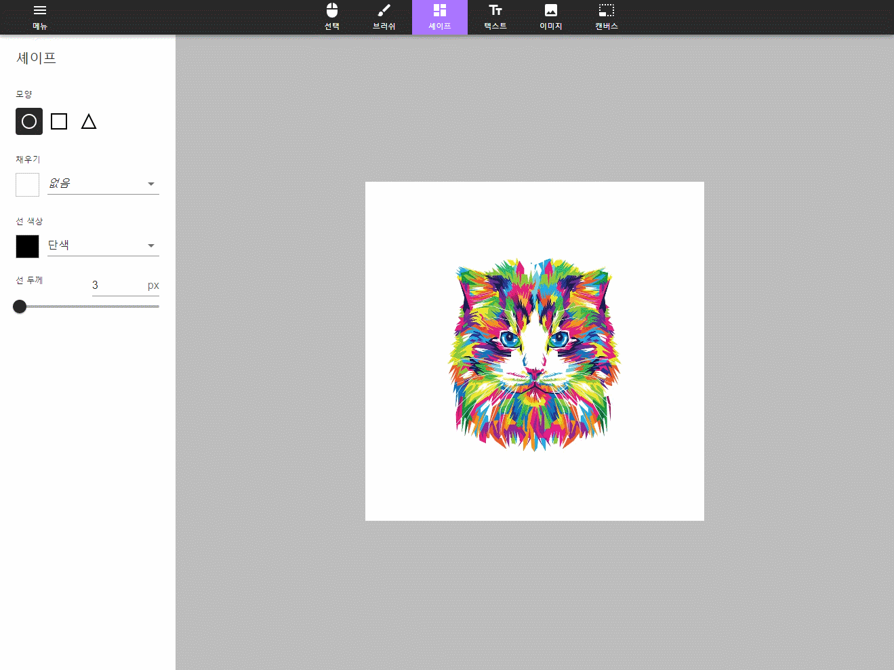

## 소개

웹 상에서 간단한 이미지를 제작할 수 있는 사이트입니다. 이용해 보시려면 [여기](https://disj11.github.io/canvas) 를 클릭해주세요.

## 기능 소개

### 캔버스 조정

캔버스 색상 변경과 크기를 조정할 수 있어요.

### 이미지 추가

사용자의 컴퓨터에 있는 이미지를 추가할 수 있어요.

### 텍스트

텍스트를 추가하고 텍스트 스타일을 변경할 수 있어요.

### 도형

동그라미, 세모, 네모 도형을 추가할 수 있어요.

### 브러시

다양한 브러시를 사용하여 직접 선을 그어보세요.

### 저장 및 불러오기

작업 중인 내용을 저장하고 불러올 수 있어요.

### 이미지 다운로드

작업 완료된 결과를 다운로드 받아보세요.

